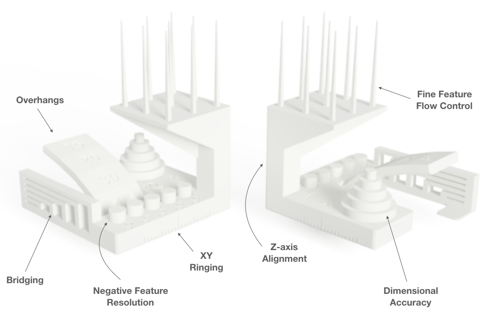

# Using the Autodesk x Kickstarter FDM 3D Printer Assessment

## Background and Rationale
Autodesk and Kickstarter have developed a common standard that enables people to assess the performance of FDM 3D printers. (You can read more about why we undertook this initiative [here](https://www.kickstarter.com/blog/2221).) The features composing this geometry are largely based off the collaboration between Andreas Bastian and Make Magazine to develop Make Magazine’s early 3D printer shootout benchmarking protocol.

The geometry we’ve developed tests how well a printer’s hardware and software are calibrated to a given material by stressing the system to the point of failure.  The failures lead to the creation of witness features that can be used to assess the performance of the slicer, the extruder, and the motion system.  While this geometry and protocol can reveal many different types of problems in a system, fixing the exposed problems is out of scope for this basic assessment protocol.

It’s important to create dedicated test features and to calibrate those features to guarantee at least partial process failure: causing failure allows you to confirm that you’ve actually reached the limits of a process, and provides something discrete to measure and compare as relevant variables are changed.

Having discrete tests that each are calibrated to cause process failure, however, can become difficult to manage as the number of specialized tests grows, so having a consolidated geometry makes the process of testing a new 3D printer more manageable. We designed geometry to group non-interfering test features in the lower half of the print and places the riskier feature at the top of the print so that it doesn’t interfere with earlier test features.

## Contributing
We’re releasing with version 4 of this geometry and would like to work with the community of testers and creators to continue to refine and build upon both this test geometry and the test protocol, both for FDM and soon for SLA, SLS, and metal AM machines as well.  Please share comments, suggestions for improvements, and other ideas by opening an issue on this repo or submitting a pull request. And, be sure to tag photos of your prints with #FDMtest!
